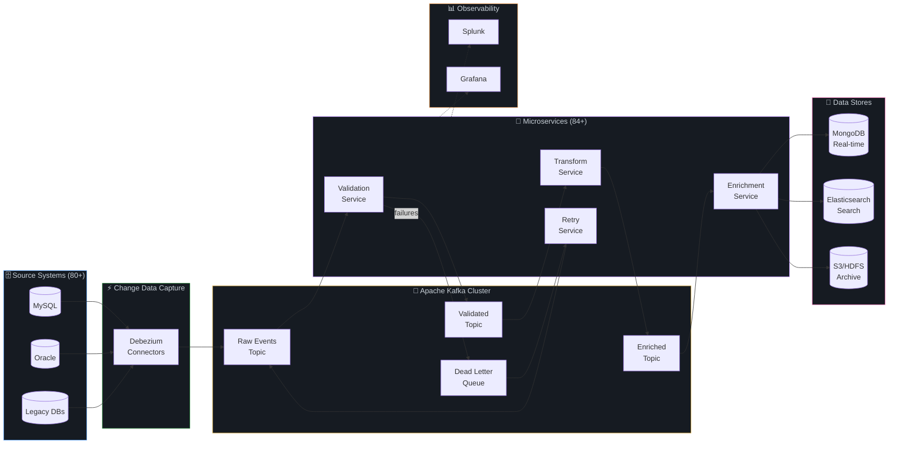
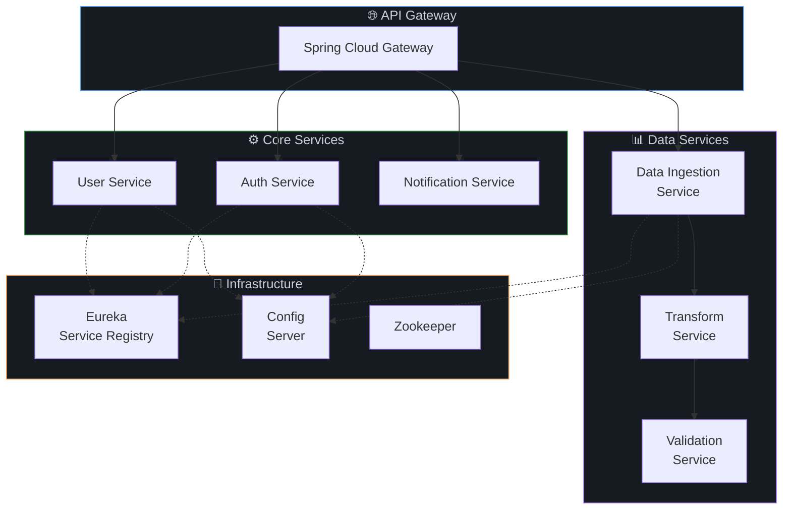
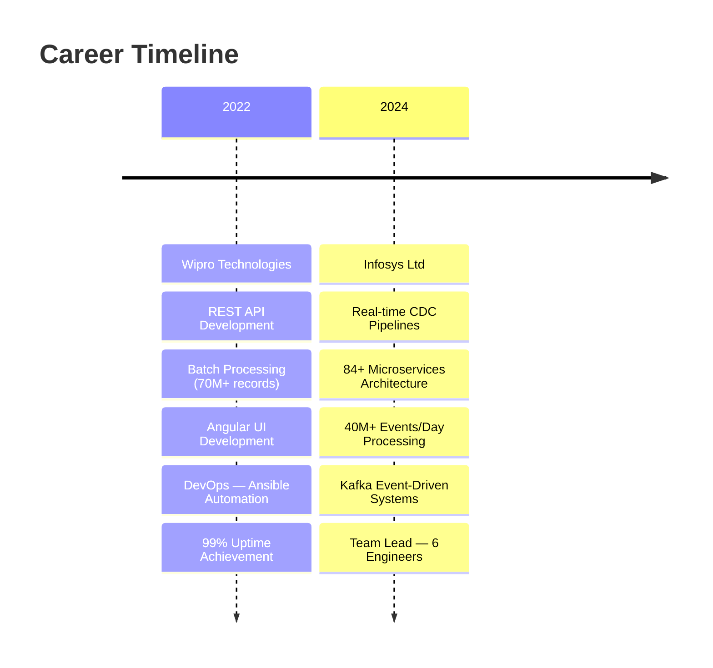

<!-- ═══════════════════════════════════════════════════════════════════════════ -->
<!-- 🚀  REPUL BEHL — FAANG-LEVEL GITHUB PROFILE README                       -->
<!-- ═══════════════════════════════════════════════════════════════════════════ -->

<!-- ░░░░░░░░░░░░░░░░░░░░░░░  ANIMATED HERO BANNER  ░░░░░░░░░░░░░░░░░░░░░░░░ -->
<p align="center">
  
</p>

<!-- ░░░░░░░░░░░░░░░░░░░░░░░░  TYPING ANIMATION  ░░░░░░░░░░░░░░░░░░░░░░░░░░ -->
<p align="center">
  <a href="https://git.io/typing-svg">
    
  </a>
</p>

<!-- ░░░░░░░░░░░░░░░░░░░░░░░  TAGLINE + SPECIALTIES  ░░░░░░░░░░░░░░░░░░░░░░ -->
<h3 align="center">
   &nbsp;
  <samp>Backend Architect · Full Stack Engineer · Data Pipeline Designer</samp>
</h3>

<p align="center">
  <a href="#-system-architecture--design">
    
  </a>&nbsp;
  <a href="#-production-impact--metrics">
    
  </a>&nbsp;
  <a href="#-full-stack-engineering">
    
  </a>&nbsp;
  <a href="#-featured-projects">
    
  </a>
</p>

<!-- ░░░░░░░░░░░░░░░░░  ANIMATED PROFILE BADGES (HOVER)  ░░░░░░░░░░░░░░░░░░ -->
<p align="center">
  <a href="https://github.com/repulbehl"></a>&nbsp;
  <a href="https://github.com/repulbehl?tab=followers"></a>&nbsp;
  <a href="https://github.com/repulbehl?tab=repositories"></a>&nbsp;
  <a href="https://www.linkedin.com/in/repul-behl-eng"></a>
</p>

<br>

<!-- ═══════════════════════════════════════════════════════════════════════════ -->
<!-- ░░░░░░░░░░░░░░░░░░░░░░░░░  ABOUT ME SECTION  ░░░░░░░░░░░░░░░░░░░░░░░░░ -->
<!-- ═══════════════════════════════════════════════════════════════════════════ -->


##  &nbsp;About Me


```js
const repulBehl = {
    role: "Senior Java Full Stack Engineer",
    experience: "3+ years",
    company: "Infosys Ltd",
    specialization: [
        "Distributed Systems",
        "Real-Time Data Pipelines",
        "Microservices Architecture"
    ],
    dailyScale: "40M+ events processed",
    teamLed: 6,
    motto: "Build systems that scale, not systems that break."
};
```

<br>

> 💡 **I don't just write code — I architect systems that process billions of records, lead engineering teams, and deliver end-to-end from React UIs to Kafka pipelines.**

<br clear="both">


<!-- ═══════════════════════════════════════════════════════════════════════════ -->
<!-- ░░░░░░░░░░░░░░░░░  PRODUCTION IMPACT & METRICS  ░░░░░░░░░░░░░░░░░░░░░░░ -->
<!-- ═══════════════════════════════════════════════════════════════════════════ -->

## 📊 Production Impact & Metrics

<table align="center">
<tr>
<td align="center" width="200">
<br>
<b>Events/Day</b><br>
<sub>Real-time CDC Pipeline</sub>
</td>
<td align="center" width="200">
<br>
<b>Microservices</b><br>
<sub>Kafka + Spring Boot</sub>
</td>
<td align="center" width="200">
<br>
<b>Records Migrated</b><br>
<sub>Spark ETL Pipelines</sub>
</td>
<td align="center" width="200">
<br>
<b>Uptime SLA</b><br>
<sub>Production Systems</sub>
</td>
</tr>
<tr>
<td align="center" width="200">
<br>
<b>Batch Records</b><br>
<sub>Processed Daily</sub>
</td>
<td align="center" width="200">
<br>
<b>Data Sources</b><br>
<sub>Consolidated</sub>
</td>
<td align="center" width="200">
<br>
<b>P1 Issues Resolved</b><br>
<sub>Production Stability</sub>
</td>
<td align="center" width="200">
<br>
<b>Engineers Led</b><br>
<sub>Team Leadership</sub>
</td>
</tr>
</table>

<br>

<!-- ═══════════════════════════════════════════════════════════════════════════ -->
<!-- ░░░░░░░░░░░░░░░░░░░  SYSTEM ARCHITECTURE & DESIGN  ░░░░░░░░░░░░░░░░░░░░ -->
<!-- ═══════════════════════════════════════════════════════════════════════════ -->


## 🏗️ System Architecture & Design

### 🔹 Real-Time CDC Data Pipeline — 40M+ Events/Day



<details>
<summary><b>📐 Architecture Decision Records</b></summary>

| Decision | Choice | Rationale |
|----------|--------|-----------|
| **Messaging** | Apache Kafka | High throughput, ordering guarantees, replay capability |
| **CDC Engine** | Debezium | Low-latency change capture without app-level changes |
| **Storage** | MongoDB | Flexible schema for event payloads, horizontal scaling |
| **Retry Strategy** | DLQ + Spring Batch | Guaranteed delivery with configurable retry policies |
| **Monitoring** | Splunk + Grafana | Real-time alerting + visual dashboards |

</details>

<br>

### 🔹 Microservices Topology



<br>

<!-- ═══════════════════════════════════════════════════════════════════════════ -->
<!-- ░░░░░░░░░░░░░░░░░░░  FULL STACK ENGINEERING  ░░░░░░░░░░░░░░░░░░░░░░░░░░ -->
<!-- ═══════════════════════════════════════════════════════════════════════════ -->


## 💻 Full Stack Engineering

> **End-to-End Ownership: UI → API → Data Pipeline → Monitoring**

<table>
<tr>
<td width="50%">

### 🎨 Frontend (React + Angular)
- ⚛️ **React.js** — Dynamic dashboards & real-time UIs
- 🅰️ **Angular** — Enterprise workflow monitoring apps
- 📊 Built monitoring dashboards for **jobs, workflows & system health**
- ⚡ Optimized UI performance with **lazy loading & memoization**
- 🔗 Integrated with **REST APIs for real-time data flow**
- 🎯 **TypeScript** for type-safe, maintainable codebases

</td>
<td width="50%">

### ⚙️ Backend (Java + Spring + Kafka)
- ☕ **Java 8+** — Core language with deep JVM expertise
- 🍃 **Spring Boot** — 84+ production microservices
- 📡 **Apache Kafka** — 40M+ events/day real-time streaming
- 🔄 **Spring Batch** — 70M+ records batch processing
- 🗄️ **Hibernate/JPA** — ORM with optimized queries
- 🐍 **Python + Flask** — Lightweight APIs & data scripts

</td>
</tr>
</table>

```
┌─────────────────────────────────────────────────────────────────────────┐
│                        END-TO-END OWNERSHIP                            │
│                                                                         │
│  React/Angular UI  →  REST APIs  →  Kafka Pipelines  →  MongoDB/MySQL  │
│       ↓                   ↓              ↓                    ↓         │
│  Dashboards         Spring Boot     Event Streaming      Data Layer     │
│  Real-time UIs      84+ Services    40M+ Events/Day     100M+ Records  │
│       ↓                   ↓              ↓                    ↓         │
│                    Splunk + Grafana Monitoring                           │
└─────────────────────────────────────────────────────────────────────────┘
```

<br>

<!-- ═══════════════════════════════════════════════════════════════════════════ -->
<!-- ░░░░░░░░░░░░░░░░░░░░░░░░░  TECH STACK GRID  ░░░░░░░░░░░░░░░░░░░░░░░░░░ -->
<!-- ═══════════════════════════════════════════════════════════════════════════ -->


## 🛠️ Technology Arsenal

<table align="center">
<tr>
<td align="center"><b>Backend</b></td>
<td>
  
</td>
</tr>
<tr>
<td align="center"><b>Frontend</b></td>
<td>
  
</td>
</tr>
<tr>
<td align="center"><b>Data & Streaming</b></td>
<td>
  
  &nbsp;&nbsp;
  
  
  
</td>
</tr>
<tr>
<td align="center"><b>DevOps & Cloud</b></td>
<td>
  
</td>
</tr>
<tr>
<td align="center"><b>Monitoring</b></td>
<td>
  
  
  
</td>
</tr>
<tr>
<td align="center"><b>AI & Productivity</b></td>
<td>
  
  
  
</td>
</tr>
</table>

<br>

<!-- ═══════════════════════════════════════════════════════════════════════════ -->
<!-- ░░░░░░░░░░░░░░░░░░░░░  FEATURED PROJECTS (PINNED)  ░░░░░░░░░░░░░░░░░░░ -->
<!-- ═══════════════════════════════════════════════════════════════════════════ -->


## 🔥 Featured Projects

<table>
<tr>
<td width="50%">

<h3 align="center">📡 Real-Time CDC Pipeline</h3>
<p align="center">
  
  
  
  
</p>

- 🔄 CDC → Kafka → MongoDB pipeline
- ⚡ 40M+ events/day throughput
- 📈 80+ source system integration
- 🛡️ DLQ-based retry mechanism
- 📊 Splunk & Grafana dashboards

</td>
<td width="50%">

<h3 align="center">🏢 Enterprise ERP System</h3>
<p align="center">
  
  
  
  
</p>

- 🏫 Full-featured School ERP Backend
- 📋 Admissions, Fees, Attendance modules
- 🔐 Role-based access control
- 📊 Reporting & Analytics dashboards
- 🚀 REST API with 50+ endpoints

</td>
</tr>
<tr>
<td width="50%">

<h3 align="center">⚡ Batch Processing Engine</h3>
<p align="center">
  
  
  
</p>

- 📈 70M+ records processed per run
- 🔄 100M+ legacy record migration
- ⏱️ Optimized chunk-based processing
- 📊 Job monitoring UI (Angular)
- 🔁 Configurable retry policies

</td>
<td width="50%">

<h3 align="center">📊 Monitoring Dashboard Suite</h3>
<p align="center">
  
  
  
  
</p>

- 📊 Real-time workflow monitoring
- 📈 System health visualization
- 🔔 Alerting & notification engine
- ⚡ Optimized API response times
- 🎨 Responsive, enterprise-grade UI

</td>
</tr>
</table>

<br>

<!-- ═══════════════════════════════════════════════════════════════════════════ -->
<!-- ░░░░░░░░░░░░░░░░░░░░░  WORK EXPERIENCE TIMELINE  ░░░░░░░░░░░░░░░░░░░░░ -->
<!-- ═══════════════════════════════════════════════════════════════════════════ -->


## 💼 Professional Journey



<details>
<summary><b>🔹 Infosys Ltd — Senior Systems Engineer (2024 - Present)</b></summary>
<br>

| Area | Impact |
|------|--------|
| **CDC Pipelines** | Built real-time CDC → Kafka → MongoDB pipelines processing 40M+ events/day |
| **Microservices** | Architected & deployed 84+ microservices with Spring Boot |
| **Data Integration** | Consolidated 80+ source systems into master data platform |
| **Team Leadership** | Led 6 engineers for end-to-end production rollouts |
| **Issue Resolution** | Resolved 100+ P1 production issues, maintaining system stability |

</details>

<details>
<summary><b>🔹 Wipro Technologies — Project Engineer (2022 - 2024)</b></summary>
<br>

| Area | Impact |
|------|--------|
| **REST APIs** | Developed & maintained enterprise REST APIs with Spring Boot |
| **Batch Processing** | Built batch frameworks processing 70M+ records |
| **Data Migration** | Migrated 100M+ legacy records using Apache Spark |
| **DevOps** | Automated deployments with Ansible, CI/CD pipelines |
| **Frontend** | Built Angular monitoring dashboards for workflow visualization |
| **Reliability** | Maintained 99% uptime across production systems |

</details>

<br>

<!-- ═══════════════════════════════════════════════════════════════════════════ -->
<!-- ░░░░░░░░░░░░░░░░░░░  EDUCATION & CERTIFICATIONS  ░░░░░░░░░░░░░░░░░░░░░ -->
<!-- ═══════════════════════════════════════════════════════════════════════════ -->


## 🎓 Education & Certifications

<table>
<tr>
<td width="50%">

### 📚 Education
🎓 **B.Tech — Information Technology**  
🏛️ Punjab Technical University  
📊 **SGPA: 8.3 / 10**

</td>
<td width="50%">

### 📜 Certifications
<br>
<br>
<br>


</td>
</tr>
</table>

<br>

<!-- ═══════════════════════════════════════════════════════════════════════════ -->
<!-- ░░░░░░░░░░░░░░░░░░░░░░░  GITHUB ANALYTICS  ░░░░░░░░░░░░░░░░░░░░░░░░░░ -->
<!-- ═══════════════════════════════════════════════════════════════════════════ -->


## 📈 GitHub Analytics

<p align="center">
  <a href="https://github.com/repulbehl">
    
  </a>
  <a href="https://github.com/repulbehl">
    
  </a>
</p>

<p align="center">
  
</p>

<p align="center">
  <a href="https://github.com/repulbehl">
    
  </a>
</p>

<br>

<!-- ═══════════════════════════════════════════════════════════════════════════ -->
<!-- ░░░░░░░░░░░░░░░░░░░░░░  CONNECT & TROPHY  ░░░░░░░░░░░░░░░░░░░░░░░░░░░ -->
<!-- ═══════════════════════════════════════════════════════════════════════════ -->


<!-- ## 🏆 GitHub Trophies

<p align="center">
  <a href="https://github.com/repulbehl">
    
  </a>
</p> -->

<br>

## 🤝 Let's Connect

<p align="center">
  <a href="https://www.linkedin.com/in/repul-behl-eng">
    
  </a>&nbsp;&nbsp;
  <a href="https://github.com/repulbehl">
    
  </a>&nbsp;&nbsp;
  <a href="mailto:repulbehl9@gmail.com">
    
  </a>&nbsp;&nbsp;
  <a href="tel:+917888559654">
    
  </a>
</p>

<br>

<!-- ░░░░░░░░░░░░░░░░░░░░  QUOTE + SNAKE ANIMATION  ░░░░░░░░░░░░░░░░░░░░░░ -->

<p align="center">
  
</p>

<p align="center">
  
</p>

<!-- ░░░░░░░░░░░░░░░░░░  ANIMATED FOOTER WAVE  ░░░░░░░░░░░░░░░░░░░░░░░░░░░ -->
<p align="center">
  
</p>

<p align="center">
  <samp><b>⭐ If you find my work interesting, consider giving it a star! ⭐</b></samp>
</p>
