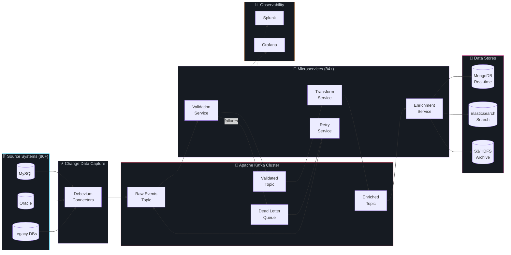
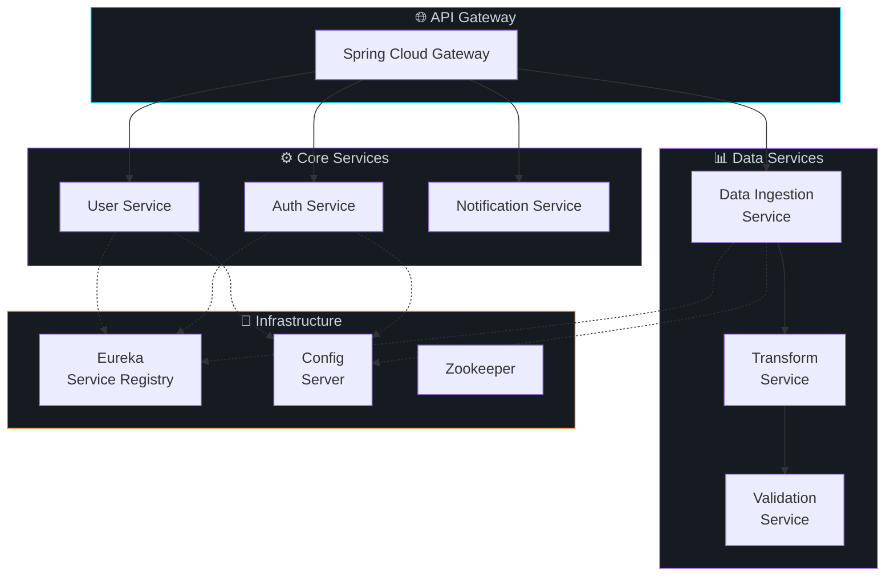
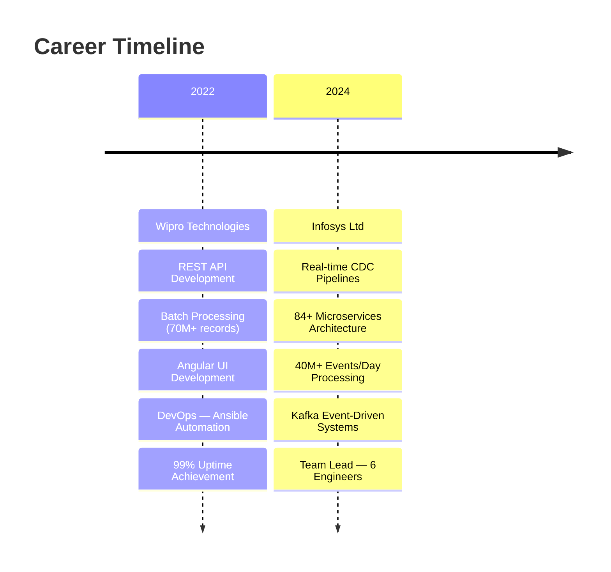
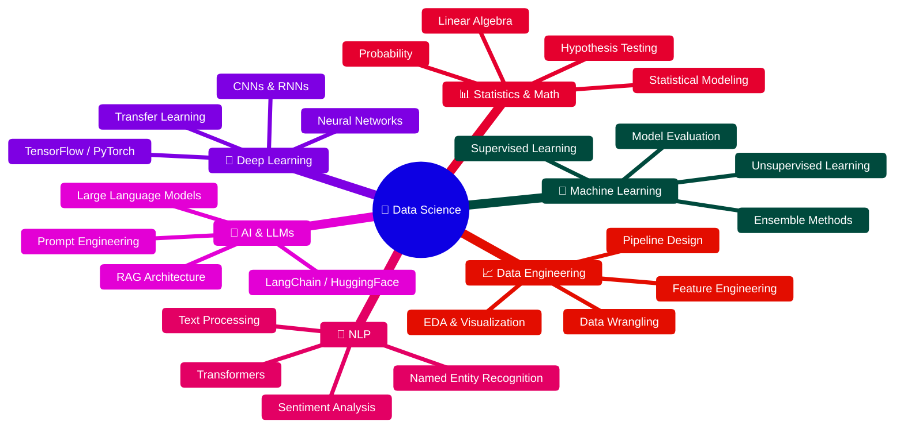

<!-- 
╔══════════════════════════════════════════════════════════════════════════════╗
║                                                                              ║
║   ██████╗ ███████╗██████╗ ██╗   ██╗██╗         ██████╗ ███████╗██╗  ██╗██╗   ║
║   ██╔══██╗██╔════╝██╔══██╗██║   ██║██║         ██╔══██╗██╔════╝██║  ██║██║   ║
║   ██████╔╝█████╗  ██████╔╝██║   ██║██║         ██████╔╝█████╗  ███████║██║   ║
║   ██╔══██╗██╔══╝  ██╔═══╝ ██║   ██║██║         ██╔══██╗██╔══╝  ██╔══██║██║   ║
║   ██║  ██║███████╗██║     ╚██████╔╝███████╗    ██████╔╝███████╗██║  ██║███████╗
║   ╚═╝  ╚═╝╚══════╝╚═╝      ╚═════╝ ╚══════╝    ╚═════╝ ╚══════╝╚═╝  ╚═╝╚══════╝ 
║                                                                              ║
║       🚀 SENIOR JAVA FULL STACK ENGINEER • DATA ENGINEER • DATA SCIENTIST 🚀  ║
║                                                                              ║
╚══════════════════════════════════════════════════════════════════════════════╝
-->
<!-- ═══════════════════════════════════════════════════════════════════════════ -->
<!-- 🚀  REPUL BEHL — FUTURISTIC GITHUB PROFILE README  v3.0                  -->
<!-- ═══════════════════════════════════════════════════════════════════════════ -->

<!-- ░░░░░░░░░░░░░░░░░░░  CYBERPUNK HERO BANNER  ░░░░░░░░░░░░░░░░░░░░░░░░░░ -->
<p align="center">
  
</p>

<!-- ░░░░░░░░░░░░░░░░░░░░  ANIMATED TYPING EFFECT  ░░░░░░░░░░░░░░░░░░░░░░░ -->
<p align="center">
  <a href="https://git.io/typing-svg">
    
  </a>
</p>

<!-- ░░░░░░░░░░░░░░░░░  FUTURISTIC ROLE TAGLINE  ░░░░░░░░░░░░░░░░░░░░░░░░░ -->
<h3 align="center">
   &nbsp;
  <samp>Backend Architect · Full Stack Engineer · Data Pipeline Designer · AI Enthusiast</samp>
</h3>

<!-- ░░░░░░░░░░░░░░░░░  QUICK NAV BADGES  ░░░░░░░░░░░░░░░░░░░░░░░░░░░░░░░ -->
<p align="center">
  <a href="#-system-architecture--design">
    
  </a>&nbsp;
  <a href="#-production-impact--metrics">
    
  </a>&nbsp;
  <a href="#-full-stack-engineering">
    
  </a>&nbsp;
  <a href="#-currently-pursuing--data-science--ai">
    
  </a>&nbsp;
  <a href="#-featured-projects">
    
  </a>
</p>

<!-- ░░░░░░░░░░░░░░░░░  ANIMATED PROFILE BADGES (HOVER)  ░░░░░░░░░░░░░░░░░░ -->
<p align="center">
  <a href="https://github.com/repulbehl"></a>&nbsp;
  <a href="https://github.com/repulbehl?tab=followers"></a>&nbsp;
  <a href="https://github.com/repulbehl?tab=repositories"></a>&nbsp;
  <a href="https://www.linkedin.com/in/repul-behl-eng"></a>
</p>


<br>

<!-- ═══════════════════════════════════════════════════════════════════════════ -->
<!-- ░░░░░░░░░░░░░░░░░░░░░░░░░  ABOUT ME SECTION  ░░░░░░░░░░░░░░░░░░░░░░░░░ -->
<!-- ═══════════════════════════════════════════════════════════════════════════ -->


##  &nbsp;About Me


```js
const repulBehl = {
    role: "Senior Java Full Stack Engineer",
    experience: "3+ years",
    company: "Infosys Ltd",
    specialization: [
        "Distributed Systems",
        "Real-Time Data Pipelines",
        "Microservices Architecture"
    ],
    dailyScale: "40M+ events processed",
    teamLed: 6,
    currentlyLearning: "Data Science & AI (PG Program)",
    motto: "Build systems that scale, not systems that break."
};
```

<br>

- 🔭 **Currently Working On:** Real-time CDC Pipelines & Enterprise ERP Systems
- 🌱 **Currently Learning:** Data Science, LLMs, Machine Learning & Deep Learning
- 👨‍💻 **Daily Impact:** Processing 40M+ events/day across 84+ microservices
- 💬 **Ask Me About:** Java, Spring Boot, Kafka, System Design, React
- ⚡ **Fun Fact:** I've resolved 100+ P1 production incidents and still sleep well 😄

<br>

> 💡 **I don't just write code — I architect systems that process billions of records, lead engineering teams, and deliver end-to-end from React UIs to Kafka pipelines.**

<br clear="both">

<!-- ═══════════════════════════════════════════════════════════════════════════ -->
<!-- ░░░░░░░░░░░░░░░░░  PRODUCTION IMPACT & METRICS  ░░░░░░░░░░░░░░░░░░░░░░░ -->
<!-- ═══════════════════════════════════════════════════════════════════════════ -->


## 🏆 Achievements & Trophies

<div align="center">
  <a href="https://github.com/ryo-ma/github-profile-trophy">
    
  </a>
</div>

<br>


## 📊 Production Impact & Metrics

<p align="center">
  
</p>

<table align="center">
<tr>
<td align="center" width="200">
<br>
<b>Events/Day</b><br>
<sub>⚡ Real-time CDC Pipeline</sub>
</td>
<td align="center" width="200">
<br>
<b>Microservices</b><br>
<sub>🔧 Kafka + Spring Boot</sub>
</td>
<td align="center" width="200">
<br>
<b>Records Migrated</b><br>
<sub>🚀 Spark ETL Pipelines</sub>
</td>
<td align="center" width="200">
<br>
<b>Uptime SLA</b><br>
<sub>🛡️ Production Systems</sub>
</td>
</tr>
<tr>
<td align="center" width="200">
<br>
<b>Batch Records</b><br>
<sub>📊 Processed Daily</sub>
</td>
<td align="center" width="200">
<br>
<b>Data Sources</b><br>
<sub>🔗 Consolidated</sub>
</td>
<td align="center" width="200">
<br>
<b>P1 Issues Resolved</b><br>
<sub>🔥 Production Stability</sub>
</td>
<td align="center" width="200">
<br>
<b>Engineers Led</b><br>
<sub>👥 Team Leadership</sub>
</td>
</tr>
</table>

<br>

<!-- ═══════════════════════════════════════════════════════════════════════════ -->
<!-- ░░░░░░░░░░░░░░░░░░░  SYSTEM ARCHITECTURE & DESIGN  ░░░░░░░░░░░░░░░░░░░░ -->
<!-- ═══════════════════════════════════════════════════════════════════════════ -->


## 🏗️ System Architecture & Design

<p align="center">
  
</p>

### 🔹 Real-Time CDC Data Pipeline — 40M+ Events/Day



<details>
<summary><b>📐 Architecture Decision Records</b></summary>

| Decision | Choice | Rationale |
|----------|--------|-----------|
| **Messaging** | Apache Kafka | High throughput, ordering guarantees, replay capability |
| **CDC Engine** | Debezium | Low-latency change capture without app-level changes |
| **Storage** | MongoDB | Flexible schema for event payloads, horizontal scaling |
| **Retry Strategy** | DLQ + Spring Batch | Guaranteed delivery with configurable retry policies |
| **Monitoring** | Splunk + Grafana | Real-time alerting + visual dashboards |

</details>

<br>

### 🔹 Microservices Topology



<br>

<!-- ═══════════════════════════════════════════════════════════════════════════ -->
<!-- ░░░░░░░░░░░░░░░░░░░  FULL STACK ENGINEERING  ░░░░░░░░░░░░░░░░░░░░░░░░░░ -->
<!-- ═══════════════════════════════════════════════════════════════════════════ -->


## 💻 Full Stack Engineering

<p align="center">
  
</p>

> **End-to-End Ownership: UI → API → Data Pipeline → Monitoring**

<table>
<tr>
<td width="50%">

### 🎨 Frontend (React + Angular)
- ⚛️ **React.js** — Dynamic dashboards & real-time UIs
- 🅰️ **Angular** — Enterprise workflow monitoring apps
- 📊 Built monitoring dashboards for **jobs, workflows & system health**
- ⚡ Optimized UI performance with **lazy loading & memoization**
- 🔗 Integrated with **REST APIs for real-time data flow**
- 🎯 **TypeScript** for type-safe, maintainable codebases

</td>
<td width="50%">

### ⚙️ Backend (Java + Spring + Kafka)
- ☕ **Java 8+** — Core language with deep JVM expertise
- 🍃 **Spring Boot** — 84+ production microservices
- 📡 **Apache Kafka** — 40M+ events/day real-time streaming
- 🔄 **Spring Batch** — 70M+ records batch processing
- 🗄️ **Hibernate/JPA** — ORM with optimized queries
- 🐍 **Python + Flask** — Lightweight APIs & data scripts

</td>
</tr>
</table>

<table align="center">
<tr><td align="center" colspan="7"><b>⚡ END-TO-END OWNERSHIP FLOW</b></td></tr>
<tr>
<td align="center"><b>🎨 React/Angular</b><br><sub>Dashboards<br>Real-time UIs</sub></td>
<td align="center"></td>
<td align="center"><b>🍃 REST APIs</b><br><sub>Spring Boot<br>84+ Services</sub></td>
<td align="center"></td>
<td align="center"><b>📡 Kafka</b><br><sub>Event Streaming<br>40M+ Events/Day</sub></td>
<td align="center"></td>
<td align="center"><b>💾 Data Layer</b><br><sub>MongoDB/MySQL<br>100M+ Records</sub></td>
</tr>
<tr><td align="center" colspan="7"><b>📊 Splunk + Grafana Monitoring</b></td></tr>
</table>

<br>

<!-- ═══════════════════════════════════════════════════════════════════════════ -->
<!-- ░░░░░░░░░░░░░░░░░░░░░░░░░  TECH STACK GRID  ░░░░░░░░░░░░░░░░░░░░░░░░░░ -->
<!-- ═══════════════════════════════════════════════════════════════════════════ -->


## 🛠️ Technology Arsenal

<!-- Tech stack with skillicons for premium look -->
<p align="center">
  
</p>

<table align="center">
<tr>
<td align="center"><b>⚙️ Backend</b></td>
<td>
  
</td>
</tr>
<tr>
<td align="center"><b>🎨 Frontend</b></td>
<td>
  
</td>
</tr>
<tr>
<td align="center"><b>📡 Data & Streaming</b></td>
<td>
  
  &nbsp;&nbsp;
  
  
  
</td>
</tr>
<tr>
<td align="center"><b>☁️ DevOps & Cloud</b></td>
<td>
  
</td>
</tr>
<tr>
<td align="center"><b>📊 Monitoring</b></td>
<td>
  
  
  
</td>
</tr>
<tr>
<td align="center"><b>🧠 AI & DS</b></td>
<td>
  
  &nbsp;&nbsp;
  
  
  
  
</td>
</tr>
<tr>
<td align="center"><b>🤖 Productivity</b></td>
<td>
  
  
  
</td>
</tr>
</table>

<br>

<!-- ═══════════════════════════════════════════════════════════════════════════ -->
<!-- ░░░░░░░░░░░░░░░░░░░░░  FEATURED PROJECTS (PINNED)  ░░░░░░░░░░░░░░░░░░░ -->
<!-- ═══════════════════════════════════════════════════════════════════════════ -->


## 🔥 Featured Projects

<p align="center">
  
</p>

<table>
<tr>
<td width="50%">

<h3 align="center">📡 Real-Time CDC Pipeline</h3>
<p align="center">
  
  
  
  
</p>

- 🔄 CDC → Kafka → MongoDB pipeline
- ⚡ 40M+ events/day throughput
- 📈 80+ source system integration
- 🛡️ DLQ-based retry mechanism
- 📊 Splunk & Grafana dashboards

</td>
<td width="50%">

<h3 align="center">🏢 Enterprise ERP System</h3>
<p align="center">
  
  
  
  
</p>

- 🏫 Full-featured School ERP Backend
- 📋 Admissions, Fees, Attendance modules
- 🔐 Role-based access control
- 📊 Reporting & Analytics dashboards
- 🚀 REST API with 50+ endpoints

</td>
</tr>
<tr>
<td width="50%">

<h3 align="center">⚡ Batch Processing Engine</h3>
<p align="center">
  
  
  
</p>

- 📈 70M+ records processed per run
- 🔄 100M+ legacy record migration
- ⏱️ Optimized chunk-based processing
- 📊 Job monitoring UI (Angular)
- 🔁 Configurable retry policies

</td>
<td width="50%">

<h3 align="center">📊 Monitoring Dashboard Suite</h3>
<p align="center">
  
  
  
  
</p>

- 📊 Real-time workflow monitoring
- 📈 System health visualization
- 🔔 Alerting & notification engine
- ⚡ Optimized API response times
- 🎨 Responsive, enterprise-grade UI

</td>
</tr>
</table>

<br>

<!-- ═══════════════════════════════════════════════════════════════════════════ -->
<!-- ░░░░░░░░░░░░░░░░░░░░░  WORK EXPERIENCE TIMELINE  ░░░░░░░░░░░░░░░░░░░░░ -->
<!-- ═══════════════════════════════════════════════════════════════════════════ -->


## 💼 Professional Journey

<p align="center">
  
</p>



<details>
<summary><b>🔹 Infosys Ltd — Senior Systems Engineer (2024 - Present)</b></summary>
<br>

| Area | Impact |
|------|--------|
| **CDC Pipelines** | Built real-time CDC → Kafka → MongoDB pipelines processing 40M+ events/day |
| **Microservices** | Architected & deployed 84+ microservices with Spring Boot |
| **Data Integration** | Consolidated 80+ source systems into master data platform |
| **Team Leadership** | Led 6 engineers for end-to-end production rollouts |
| **Issue Resolution** | Resolved 100+ P1 production issues, maintaining system stability |

</details>

<details>
<summary><b>🔹 Wipro Technologies — Project Engineer (2022 - 2024)</b></summary>
<br>

| Area | Impact |
|------|--------|
| **REST APIs** | Developed & maintained enterprise REST APIs with Spring Boot |
| **Batch Processing** | Built batch frameworks processing 70M+ records |
| **Data Migration** | Migrated 100M+ legacy records using Apache Spark |
| **DevOps** | Automated deployments with Ansible, CI/CD pipelines |
| **Frontend** | Built Angular monitoring dashboards for workflow visualization |
| **Reliability** | Maintained 99% uptime across production systems |

</details>

<br>

<!-- ═══════════════════════════════════════════════════════════════════════════ -->
<!-- ░░░░░░░░░░░░░░░░░░░  EDUCATION & CERTIFICATIONS  ░░░░░░░░░░░░░░░░░░░░░ -->
<!-- ═══════════════════════════════════════════════════════════════════════════ -->


## 🎓 Education & Certifications

<p align="center">
  
</p>

<table>
<tr>
<td width="50%">

### 📚 Education
🎓 **B.Tech — Information Technology**  
🏛️ Punjab Technical University  
📊 **SGPA: 8.3 / 10**

</td>
<td width="50%">

### 📜 Certifications
<br>
<br>
<br>


</td>
</tr>
</table>

<br>

<!-- ═══════════════════════════════════════════════════════════════════════════ -->
<!-- ░░░░░░░░░░░░░░░  CURRENTLY PURSUING — DATA SCIENCE & AI  ░░░░░░░░░░░░░░ -->
<!-- ═══════════════════════════════════════════════════════════════════════════ -->


## 🧠 Currently Pursuing — Data Science & AI

<p align="center">
  
</p>

<table>
<tr>
<td width="50%">

### 📖 Post Graduate Program in Data Science
🎯 **Actively upskilling** to bridge **Backend Engineering + Data Science**

> 🚀 *Goal: Combine 3+ years of production-scale data pipeline experience with advanced ML & AI skills to build intelligent, data-driven systems.*

**Why This Matters:**
- 📊 Already processing **40M+ events/day** — now learning to **extract intelligence** from that data
- 🔄 Transitioning from **data engineering** to **full-stack AI/ML engineering**
- 🤖 Building the bridge between **scalable infrastructure** & **intelligent systems**

</td>
<td width="50%">

### 📊 Key Modules & Skills

| Module | Status |
|--------|--------|
| 📈 **Hypothesis Testing** | 🟢 Active |
| 🤖 **Large Language Models (LLMs)** | 🟢 Active |
| 🧮 **Machine Learning** | 🟢 Active |
| 📝 **Natural Language Processing** | 🟡 In Progress |
| 📊 **Exploratory Data Analysis** | ✅ Completed |
| 📉 **Statistical Modeling** | ✅ Completed |
| 🔬 **Deep Learning** | 🟡 In Progress |
| 🧹 **Data Wrangling** | ✅ Completed |

</td>
</tr>
</table>

### 🗺️ Data Science Learning Roadmap



<p align="center">
  
  
  
  
  
  
  
  
  
  
</p>

<br>

<!-- ═══════════════════════════════════════════════════════════════════════════ -->
<!-- ░░░░░░░░░░░░░░░░░░░  GITHUB ANALYTICS — PREMIUM  ░░░░░░░░░░░░░░░░░░░░░ -->
<!-- ═══════════════════════════════════════════════════════════════════════════ -->


## 📈 GitHub Analytics

<p align="center">
  
</p>

<!-- Stats + Streak side by side -->
<p align="center">
  <a href="https://github.com/repulbehl">
    
  </a>
  <a href="https://github.com/repulbehl">
    
  </a>
</p>

<!-- Activity Graph -->
<p align="center">
  
</p>

<!-- Profile Summary Cards — 5 Premium Cards -->
<p align="center">
  <a href="https://github.com/repulbehl">
    
  </a>
  <a href="https://github.com/repulbehl">
    
  </a>
  <a href="https://github.com/repulbehl">
    
  </a>
</p>

<p align="center">
  <a href="https://github.com/repulbehl">
    
  </a>
   <a href="https://github.com/repulbehl">
    
  </a>
</p>

<!-- Top Languages donut -->
<p align="center">
  <a href="https://github.com/repulbehl">
    
  </a>
</p>

<br>

<!-- ═══════════════════════════════════════════════════════════════════════════ -->
<!-- ░░░░░░░░░░░░░░░░░░░░░░  CONNECT & SOCIAL  ░░░░░░░░░░░░░░░░░░░░░░░░░░░ -->
<!-- ═══════════════════════════════════════════════════════════════════════════ -->


## 🤝 Let's Connect

<p align="center">
  
</p>

<p align="center">
  <i>Open to collaborations, opportunities, and conversations about distributed systems, data engineering, & AI/ML!</i>
</p>

<p align="center">
  <a href="https://www.linkedin.com/in/repul-behl-eng">
    
  </a>&nbsp;&nbsp;
  <a href="https://github.com/repulbehl">
    
  </a>&nbsp;&nbsp;
  <a href="mailto:repulbehl9@gmail.com">
    
  </a>&nbsp;&nbsp;
  <a href="tel:+917888559654">
    
  </a>
</p>

<br>

<!-- ░░░░░░░░░░░░░░░░░░░░░░  QUOTE + SNAKE  ░░░░░░░░░░░░░░░░░░░░░░░░░░░░░ -->

<p align="center">
  
</p>

<p align="center">
  
</p>

<!-- ░░░░░░░░░░░░░░░░░░  FUTURISTIC FOOTER  ░░░░░░░░░░░░░░░░░░░░░░░░░░░░░ -->
<p align="center">
  
</p>

<p align="center">
  <samp><b>「 Systems that scale. Code that matters. Impact that lasts. 」</b></samp>
</p>

<p align="center">
  <samp>⭐ If you find my work interesting, consider giving it a star! ⭐</samp>
</p>
